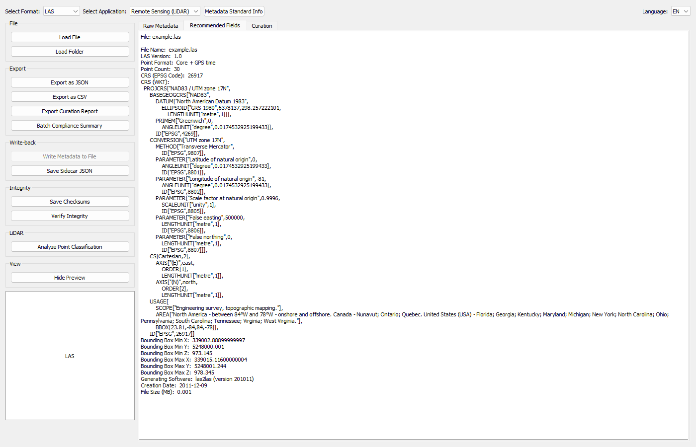

# Image Metadata Viewer (IMetVi)

**IMetVi** is a cross-format desktop application for extracting,
standardizing, displaying, exporting, and curating scientific image
metadata. It targets researchers, librarians, and research technicians
working with microscopy, remote sensing, medical, astronomical, and
general-purpose image files in Canadian academic institutions.

See [`ARCHITECTURE.md`](ARCHITECTURE.md) for how the codebase is
organized, [`ROADMAP.md`](ROADMAP.md) for planned/in-progress work, and
[`UPDATES.md`](UPDATES.md) for a chronological changelog.

## Features

- 🖼️ **Supported formats**, each mapped to a discipline-aligned standard:

  | Format | Extensions | Standard |
  |---|---|---|
  | TIFF | `.tif` `.tiff` | REMBI (microscopy) |
  | CZI (Zeiss) | `.czi` | REMBI (microscopy) |
  | OME-TIFF | `.tif` `.tiff` | OME-XML |
  | GeoTIFF | `.tif` `.tiff` | ISO 19115 (geospatial) |
  | JPG / JPEG | `.jpg` `.jpeg` | EXIF + IPTC + XMP |
  | PNG | `.png` | EXIF-style general fields |
  | DICOM | `.dcm` | DICOM PS3.3 (patient-identifying fields excluded by design) |
  | FITS | `.fits` `.fit` | FITS / WCS (astronomy) |
  | HDF5 | `.h5` `.hdf5` `.nc4` | Generic container inspection |
  | LIF (Leica) | `.lif` | REMBI (microscopy) |
  | NetCDF | `.nc` `.nc4` | ISO 19115 via CF Conventions |

  Formats sharing an extension (TIFF / OME-TIFF / GeoTIFF all use
  `.tif`/`.tiff`; HDF5 / NetCDF both cover `.nc4`) are selected explicitly
  via the format dropdown, which auto-suggests a match on load.

- 📁 Load a single file or an entire folder (batch loading runs off the UI
  thread with a progress bar).
- 🇨🇦 **Bilingual EN/FR interface** — a language selector switches every
  button, label, tooltip, dialog, and error/success message between
  English and French, including the dynamically rendered Curation
  summary. (Extracted metadata field labels and standards documentation
  text are not yet translated — see [`ARCHITECTURE.md`](ARCHITECTURE.md).)
- 🖼️ **Collapsible thumbnail preview** — confirms visually which file is
  loaded (JPG/PNG/TIFF, first page for multi-page TIFF); other formats
  show a generic extension placeholder.
- 🧾 **Three-tab metadata view**:
  - *Raw Metadata* — everything the parser extracted, unfiltered.
  - *Recommended Fields* — standardized, discipline-aligned fields with
    human-readable labels and units.
  - *Curation* — automated flags and integrity info for this file.
- ℹ️ **Metadata Standard Info** dialog — for the active context, shows
  what the target standard requires and honestly reports what is (and
  isn't) captured from the file itself.
- 🚩 **Curation flags**, computed per batch:
  - `DUPLICATE` — identical MD5 checksum to another file in the batch
  - `CORRUPT` — parser reported a read failure
  - `HAS_GPS_DATA` — GPS metadata present (privacy/consent flag)
  - `DIMENSION_OUTLIER` — dimensions deviate from the batch's most common size
  - `LOSSY_TIFF` — TIFF using internal JPEG compression
- ✍️ **Write metadata back into the file** (JPEG: EXIF + IPTC + XMP; TIFF:
  `ImageDescription`), with an editable form and an overwrite confirmation.
- 📎 **Save Sidecar JSON** — writes `<basename>.json` beside the source
  image without touching the original (QGIS/ArcGIS/repository convention).
- 🔒 **Cross-session integrity verification** — `Save Checksums` persists
  a `checksums.json` manifest per folder; `Verify Integrity` re-scans and
  reports `OK` / `MODIFIED` / `MISSING` / `NEW` per file.
- 💾 **Export**:
  - Standardized metadata as JSON or CSV (single file or full batch)
  - Dedicated **Curation Report** CSV (one row per file, curation-focused
    columns, compatible with `CUR_Res_CurationTools` report shape)

## Screenshot

> 
> *Example showing TIFF metadata extraction with four channels*

---

## Installation

### Requirements

- Python 3.8+
- Tested on Windows 10/11
- Recommended: run within a conda or venv environment

### Dependencies

```bash
pip install -r requirements.txt
```

### Launch the App

```bash
python main.py
```

### Run the tests

```bash
python -m pytest -q
```

---

## License
This project is licensed under the MIT License. See LICENSE for details.

---

## Acknowledgements

- TIFF handling: [tifffile](https://github.com/cgohlke/tifffile)
- Zeiss CZI reader: [czifile](https://github.com/cgohlke/czifile)
- Leica LIF reader: [readlif](https://github.com/nimne/readlif)
- EXIF read/write: [Pillow](https://python-pillow.org/) + [piexif](https://piexif.readthedocs.io/)
- IPTC read/write: [iptcinfo3](https://github.com/jkelleyrtp/iptcinfo3)
- GeoTIFF / geospatial: [rasterio](https://rasterio.readthedocs.io/)
- HDF5: [h5py](https://www.h5py.org/)
- DICOM: [pydicom](https://pydicom.github.io/)
- FITS: [astropy](https://www.astropy.org/)
- REMBI Guidelines: https://doi.org/10.1038/s41592-021-01166-8
- OME-XML spec: https://www.openmicroscopy.org/ome-files/
- ISO 19115 (geospatial metadata): https://www.iso.org/standard/53798.html
- IPTC standard: https://www.iptc.org/std/photometadata/specification/
